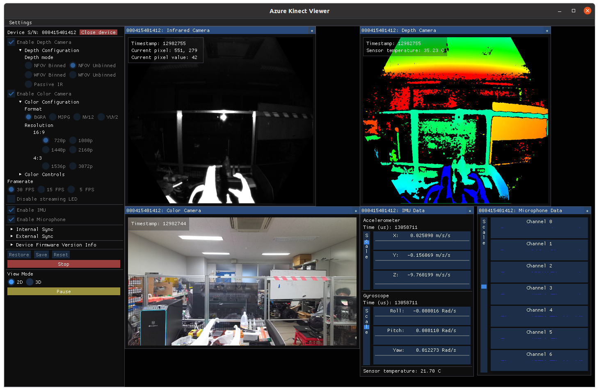

# Installation of Azure Kinect Sensor SDK on Linux Ubuntu 20.04

To install the azure kinect sensor sdk on linux ubuntu without adding keys, you must get the latest binaries file from this repository itself

The required binaries are
- k4a-tools
- libk4a
- libk4a-dev

## 1. Download required binary file

Repository for k4a-tools
```
https://packages.microsoft.com/ubuntu/18.04/prod/pool/main/k/k4a-tools/
```

Repository for libk4a and libk4a-dev
```
https://packages.microsoft.com/ubuntu/18.04/prod/pool/main/libk/
```

**OR, you can download all given files from this repository**

In my case, I downloaded the latest version from both repositories
-   k4a-tools_1.4.1_amd64.deb
-   libk4a1.4_1.4.1_amd64.deb
-   libk4a1.4-dev_1.4.1_amd64.deb

## 2. Install pre-requisite package

Install lib named libsoundio1, libsoundio-dev
```
sudo apt-get install libsoundio1 libsoundio-dev
```

## 3. Install the downloaded binary files

After install the pre-requisite packages, use `sudo dpkg -i {package_name}` to install the binary file
```
sudo dpkg -i libk4a1.4_1.4.1_amd64.deb
```
```
sudo dpkg -i libk4a1.4-dev_1.4.1_amd64.deb
```
```
sudo dpkg -i k4a-tools_1.4.1_amd64.deb
```

## 4. USB Mapping

After install all packages, we should do the USB port mapping in order when we plug in or start up the linux, the device will automatically enumerate and load all drivers.

4.1 Create the rules file named `99-k4a.rules`
```
sudo touch /etc/udev/rules.d/99-k4a.rules
```
4.2 Go to directory `/etc/udev/rules.d/` to edit file `99-k4a.rules`
```
cd /etc/udev/rules.d
```

4.3 open the file with your favorite editor in sudo mode, but this will use gedit to edit the file
```
sudo gedit 99-k4a.rules
``` 
4.4 Copy these texts into the `99-k4a.rules`, then save and exit
```
# Bus 002 Device 116: ID 045e:097a Microsoft Corp.  - Generic Superspeed USB Hub
# Bus 001 Device 015: ID 045e:097b Microsoft Corp.  - Generic USB Hub
# Bus 002 Device 118: ID 045e:097c Microsoft Corp.  - Azure Kinect Depth Camera
# Bus 002 Device 117: ID 045e:097d Microsoft Corp.  - Azure Kinect 4K Camera
# Bus 001 Device 016: ID 045e:097e Microsoft Corp.  - Azure Kinect Microphone Array

BUS!="usb", ACTION!="add", SUBSYSTEM!=="usb_device", GOTO="k4a_logic_rules_end"

ATTRS{idVendor}=="045e", ATTRS{idProduct}=="097a", MODE="0666", GROUP="plugdev"
ATTRS{idVendor}=="045e", ATTRS{idProduct}=="097b", MODE="0666", GROUP="plugdev"
ATTRS{idVendor}=="045e", ATTRS{idProduct}=="097c", MODE="0666", GROUP="plugdev"
ATTRS{idVendor}=="045e", ATTRS{idProduct}=="097d", MODE="0666", GROUP="plugdev"
ATTRS{idVendor}=="045e", ATTRS{idProduct}=="097e", MODE="0666", GROUP="plugdev"

LABEL="k4a_logic_rules_end"
```
4.5 After save and unplug and plug the azure usb again and use k4aviewer to open device
```
k4aviewer
```


You should see streaming image like this

## 5. ROS Driver

If you use ROS, microsoft also deploy ROS driver compatible for Azure kinect DK from this [link](https://github.com/microsoft/Azure_Kinect_ROS_Driver/tree/melodic).
